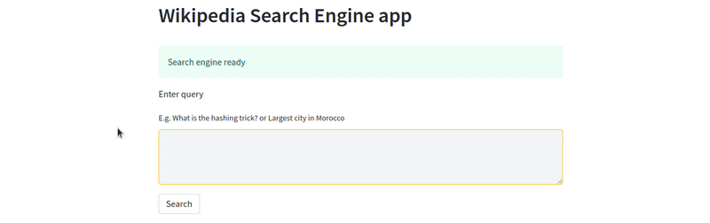

# Wikipedia Search Engine

This project builds a Search Engine that takes as input a query (such as *What is the hashing trick?* or *date of French revolution*) and outputs a the top 3 Wikipedia articles that may help answer that query.

Link to search engine: [wikipedia-search-engine](https://huggingface.co/spaces/abokbot/wikipedia-search-engine#wikipedia-search-engine-app)

## Demo



## Wikipedia articles dataset
We used a dataset that contains the first paragraph of cleaned Wikipedia articles in English. The dataset can be accessed on HuggingFace: [abokbot/wikipedia-first-paragraph](https://huggingface.co/datasets/abokbot/wikipedia-first-paragraph).

That dataset was obtained by transorming the [Wikipedia](https://huggingface.co/datasets/wikipedia) "20220301.en" dataset as follows:
```python
from datasets import load_dataset

dataset = load_dataset("wikipedia", "20220301.en")["train"]

def get_first_paragraph(example):
  example["text"] = example['text'].split('\n\n')[0]
  return example

dataset = dataset.map(get_first_paragraph)
```

### Why this dataset?
The size of the original English Wikipedia dataset is over 20GB. It takes 20min to load it on a Google Colab notebook and running computations on that dataset can be costly.

We made the assumption that the most important information of a Wikipeida article is in its first paragraph and decided to work with that. The dataset of first paragraphs of Wikipedia pages had a size of 1.39GB and it takes 5 min to load it on a Google colab notebook.

### Dataset Structure
An example looks as follows:
```
{
  'id': '12',
  'url': 'https://en.wikipedia.org/wiki/Anarchism',
  'title': 'Anarchism',
  'text': 'Anarchism is a political philosophy and movement that is sceptical of authority and rejects \
          all involuntary, coercive forms of hierarchy. Anarchism calls for the abolition of the state, \
          which it holds to be unnecessary, undesirable, and harmful. As a historically left-wing movement, \
          placed on the farthest left of the political spectrum, it is usually described alongside communalism \
          and libertarian Marxism as the libertarian wing (libertarian socialism) of the socialist movement, and \
          has a strong historical association with anti-capitalism and socialism.'
}
```

## Embedding the Wikipedia articles
We use [MS Marco Encoder](https://www.sbert.net/docs/pretrained-models/msmarco-v3.html) msmarco-MiniLM-L-6-v3 from the sentence-transformers library to encode the wikipedia first paragraphs dataset.

It was obtained by running the following code.

```python
from datasets import load_dataset
from sentence_transformers import SentenceTransformer

dataset = load_dataset("abokbot/wikipedia-first-paragraph")
bi_encoder = SentenceTransformer('msmarco-MiniLM-L-6-v3')
bi_encoder.max_seq_length = 256
wikipedia_embedding = bi_encoder.encode(dataset["text"], convert_to_tensor=True, show_progress_bar=True)

```
The output is an embedding tensor of size [6458670, 384]. This operation took 35min on a Google Colab notebook with GPU.
The embedding can be accessed on HuggingFace: [abokbot/wikipedia-embedding](https://huggingface.co/abokbot/wikipedia-embedding).

## Retrieve & Re-Rank pipeline
Below is a graph from the [great article](https://www.sbert.net/examples/applications/retrieve_rerank/README.html) by the sentance-transformers library on Retrieve & Re-Rank.


When a query is entered in the search engine, it is encoded by the same bi-encoder and the artciles with highest cosine-similarity are retrieved.

Next, the retrieved candidates are scored by a Cross-Encoder re-ranker and the 3 passages with the highest score from the Cross-Encoder are presented to the user.

The code of the pipeline is in the app.py script.
